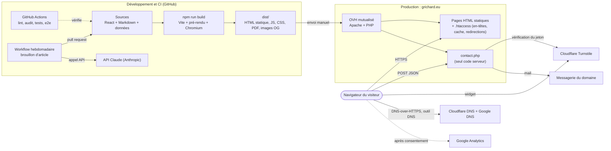

# Portfolio — Guillaume Richard

Site personnel bilingue (FR/EN) : React 19 + Vite + Tailwind CSS 4, hébergé sur OVH (mutualisé, Apache + PHP).
Production : <https://grichard.eu>

> Ce dépôt est public. Il ne contient **aucun secret** : la clé secrète Turnstile, la clé de l'API Anthropic et l'accès à l'hébergement
> n'y figurent jamais (voir « Secrets et configuration »). Les valeurs publiques (clé de site Turnstile, identifiant de mesure d'audience) sont par nature visibles dans le site.

## Sommaire

[Infrastructure](#infrastructure)
[Bibliothèques](#bibliothèques-et-dépendances)
[Architecture du code](#architecture)
[Outils](#outils-outils-entools)
[Outil DNS](#outil-dns-et-e-mail-outilsdns-entoolsdns)
[Articles hebdomadaires](#articles-hebdomadaires-brouillon-par-ia-publication-après-relecture)
[Terminal et palette](#terminal-interactif-et-palette-de-commandes) · [Design system](#design-system-et-thèmes)
[Développement](#développement)
[Tests et CI](#tests-et-intégration-continue)
[Déploiement](#déploiement-ovh)
[Sécurité](#sécurité)

## Infrastructure

Un site **statique** servi par un hébergement mutualisé, plus un seul script serveur (le formulaire de contact). Pas de base de données, pas de serveur d'application,
pas de conteneur : tout ce qui demande du calcul se passe au **build** (sur la machine du développeur ou sur GitHub Actions) ou dans le **navigateur** du visiteur.



| Brique | Rôle | Où et comment |
|---|---|---|
| **Hébergement** | Sert les fichiers de `dist/` et exécute `contact.php` | OVH, offre mutualisée (Apache + PHP). Déploiement **manuel** : envoi du contenu de `dist/` (voir « Déploiement ») |
| **Apache (`public/.htaccess`)** | Cache, compression, en-têtes de sécurité (CSP, HSTS…), redirections canoniques (HTTP → HTTPS, `www` → domaine nu, `index.html` → `/`), vrai 404, fichiers sensibles refusés | Copié tel quel dans `dist/` |
| **PHP (`public/contact.php`)** | Reçoit le formulaire, vérifie Turnstile, limite le débit, envoie l'e-mail avec `mail()` | Seul code exécuté côté serveur ; aucune dépendance (pas de Composer) |
| **Cloudflare Turnstile** | Captcha du formulaire | Widget chargé dans le navigateur ; jeton vérifié par `contact.php` auprès de Cloudflare |
| **Résolveurs DoH** (Cloudflare, Google) | Requêtes DNS de l'outil DNS | Interrogés **directement par le navigateur** du visiteur ; le site ne relaie ni ne stocke rien |
| **Google Analytics** | Mesure d'audience | Chargé **uniquement après consentement** (`public/js/consent.js`) |
| **GitHub** | Code, historique, pull requests | Dépôt public ; l'historique Git sert aussi de source aux dates de « dernière modification » des pages |
| **GitHub Actions** | CI et génération des brouillons d'articles | `.github/workflows/ci.yml` et `weekly-article.yml` (voir « Tests et CI » et « Articles hebdomadaires ») |
| **API Claude (Anthropic)** | Rédaction des brouillons d'articles | Appelée **uniquement depuis le workflow hebdomadaire**, jamais depuis le site ni le navigateur |
| **Chromium (Playwright)** | Au build : images de partage (OG) des articles et PDF des CV ; en test : tests de bout en bout | Installé par `npx playwright install chromium` ; optionnel pour un build rapide (`BUILD_FAST=1`) |

**Ce que le site ne fait pas** : pas de base de données, pas de compte utilisateur, pas de cookie avant consentement, pas de police ni de script tiers avant consentement,
pas de rendu côté serveur à la requête (tout est généré au build), pas d'envoi de données saisies dans les outils (ils tournent dans le navigateur ; seul l'outil DNS fait des requêtes, vers les résolveurs publics).

### Du source au site en ligne

1. **Source** : le contenu vit dans `src/data/` (textes FR/EN, outils) et `content/blog/` (articles Markdown) ; l'interface dans `src/` (React).
2. **Build** (`npm run build`) : Vite produit le CSS et les bundles JS hachés (`dist/assets/`), puis `scripts/prerender.js` démarre Vite en mode serveur pour exécuter `src/entry-server.jsx` et écrire
   **chaque page en HTML statique**, avec `sitemap.xml`, `llms.txt`, flux RSS, index de recherche, JSON-LD, `hreflang`, images OG et PDF des CV.
3. **Vérification** : `npm run check` (lint, tests unitaires, tests de bout en bout sur le site construit), exécuté aussi par la CI à chaque push et pull request.
4. **Mise en ligne** : envoi manuel de `dist/` sur l'hébergement. Aucun déploiement automatique : une fusion sur `main` ne publie rien à elle seule.

### Secrets et configuration

| Valeur | Nature | Où elle vit |
|---|---|---|
| `VITE_TURNSTILE_SITE_KEY` | Clé de **site** Turnstile, **publique** (visible dans le HTML) | `.env.local` en local (ignoré par Git), clé de test Cloudflare dans la CI |
| Clé **secrète** Turnstile (`TURNSTILE_SECRET`) | **Secret** | `contact.config.php` sur le serveur, ignoré par Git, hors de la racine web ; ou variable d'environnement |
| `ANTHROPIC_API_KEY` | **Secret** | Secret de dépôt GitHub Actions, lu par le seul workflow hebdomadaire |
| `ARTICLE_MODEL` | Réglage (modèle utilisé pour les brouillons) | Variable d'environnement du workflow, facultative |
| `BUILD_FAST` | Réglage (saute images OG et PDF) | Variable d'environnement, facultative |

Le modèle `contact.config.example.php` ne contient qu'un texte à remplacer. `.gitignore` exclut `.env`, `.env.local`, `contact.config.php` et les caches de build.

## Bibliothèques et dépendances

Le choix assumé est un **minimum de dépendances à l'exécution** : trois paquets sont livrés aux visiteurs. Tout le reste est un outil de build, de test ou de CI.
Beaucoup de briques sont **écrites à la main** plutôt qu'importées (voir la dernière table), chacune avec ses tests.

### Livrées dans le navigateur (`dependencies`)

| Paquet | Version | Rôle |
|---|---|---|
| [`react`](https://react.dev) | 19 | Interface des îlots (contact, terminal, outils) et rendu des pages au build |
| [`react-dom`](https://react.dev) | 19 | Hydratation des îlots (`hydrateRoot`), rendu statique au build (`renderToString`), rendu complet côté client en développement seulement (`createRoot`) |
| [`lucide-react`](https://lucide.dev) | 1.x | Icônes SVG (importées une à une, donc élaguées au build) |

### Build et outillage (`devDependencies`, jamais livrées)

| Paquet | Version | Rôle |
|---|---|---|
| [`vite`](https://vite.dev) | 8 | Serveur de développement, bundler, manifeste des fichiers produits ; sert aussi de moteur de chargement des modules au pré-rendu |
| [`@vitejs/plugin-react`](https://github.com/vitejs/vite-plugin-react) | 6 | Support JSX et Fast Refresh |
| [`tailwindcss`](https://tailwindcss.com) + `@tailwindcss/vite` | 4 | CSS utilitaire, jetons de thème déclarés en `@theme` dans `src/index.css` (pas de fichier de configuration séparé) |
| [`marked`](https://marked.js.org) | 18 | Markdown → HTML des articles, au build seulement (le HTML des articles est de confiance, voir « Sécurité ») |
| [`oxlint`](https://oxc.rs) | 1.x | Lint rapide : règles React, hooks (`exhaustive-deps`), accessibilité JSX (`jsx-a11y`) |

### Tests

| Paquet | Version | Rôle |
|---|---|---|
| [`vitest`](https://vitest.dev) | 4 | Tests unitaires (`tests/unit/`) et tests « live » contre les vrais résolveurs DNS (`tests/live/`) |
| [`@playwright/test`](https://playwright.dev) | 1.x | Tests de bout en bout sur le site construit (`tests/e2e/`) ; son Chromium rend aussi les images OG et les PDF au build |
| [`@axe-core/playwright`](https://github.com/dequelabs/axe-core-npm) | 4 | Contrôle d'accessibilité WCAG automatisé dans les deux thèmes |

### Génération d'articles

| Paquet | Version | Rôle |
|---|---|---|
| [`@anthropic-ai/sdk`](https://github.com/anthropics/anthropic-sdk-typescript) | 0.x | Client de l'API Claude, utilisé par `scripts/generate-article.js` dans le workflow hebdomadaire uniquement |

### Plateforme

- **Node.js ≥ 22** (champ `engines`, et version utilisée par la CI). Modules ES partout (`"type": "module"`).
- **Actions GitHub** : `actions/checkout@v4`, `actions/setup-node@v4` (cache npm), `actions/upload-artifact@v4` (rapport Playwright en cas d'échec) et la CLI `gh` (ouverture des pull requests d'articles).
- **Ressources chargées depuis des CDN, au build seulement** : les sources HTML des CV (`public/cv-fr.html`, `public/cv-en.html`) utilisent Tailwind, Inter et Lucide par CDN pour produire les PDF. Le site lui-même n'en charge aucun
  (polices système, aucune ressource tierce avant consentement).

### Ce qui est écrit à la main (et pourquoi)

| Brique | Fichiers | Pourquoi pas une bibliothèque |
|---|---|---|
| Analyseur JSON | `src/lib/json.js` | Position exacte en ligne/colonne, nombres et chaînes recopiés tels quels, messages identiques d'un navigateur à l'autre |
| Bibliothèque iCalendar (analyse, fuseaux, découpage, comparaison) | `src/lib/ics/` | Les événements sont recopiés à l'identique, jamais re-sérialisés ; fuseaux Windows d'Outlook gérés |
| Écriture de ZIP | `src/lib/zip.js` | Archive « stockée » sans compression : quelques dizaines de lignes au lieu d'une dépendance |
| Analyse DNS, SPF, DKIM, DMARC, MX | `src/lib/dns/` | Logique pure et testée, sans DOM ; décompte récursif des requêtes SPF |
| En-têtes d'e-mail, calcul d'adresses (CIDR, VLSM), encodage, JWT, empreintes, mots de passe, unités | `src/lib/mail/`, `net/`, `encode/`, `password.js`, `units.js` | Fonctions pures, hors réseau ; MD5 local, SHA via `SubtleCrypto`, aléa via `crypto.getRandomValues` |
| Front matter, sitemap, RSS, JSON-LD, index de recherche, images OG | `scripts/lib/` | Front matter volontairement strict (les titres contiennent des « : ») ; chaque artefact est vérifié par un test |
| Interpréteur du terminal, palette de commandes | `src/lib/terminal/`, `public/js/palette.js` | Interpréteur pur ; palette en `<dialog>` natif sans framework |
| Thème, menu, bandeau de cookies, halo des cartes | `public/js/` | Petits scripts autonomes, sans React, compatibles avec une CSP sans script en ligne |

Pour mettre les dépendances à jour : `npm outdated`, puis `npm update`, puis `npm run check`. La CI échoue sur une vulnérabilité **haute** des dépendances de production (`npm audit --omit=dev`).

## Architecture

Le site est **entièrement pré-rendu** au build (HTML statique, lisible sans JavaScript). React n'hydrate que des zones
interactives (« îlots ») : le formulaire de contact et le terminal sur l'accueil, l'outil de sa page sur chaque page d'outil. Le menu, la bascule de thème, le surlignage de section, l'effet de halo des cartes et le
bandeau de cookies sont de petits scripts autonomes (`public/js/`), qui fonctionnent sur toutes les pages sans React.

```
index.html              Gabarit de développement uniquement (le HTML de production est généré par le pré-rendu)
src/
  data/content.js       TOUT le contenu (FR/EN), liens, mentions légales, chemins par langue (LANGS)
  main.jsx              Point d'entrée navigateur : charge et hydrate uniquement les îlots présents dans la page (en dev, rend toute la page)
  islands/              Un module par îlot (contact.jsx, terminal.jsx, tools/<id>.jsx), chargé dynamiquement : chaque page ne télécharge que son code
  App.jsx               Accueil (assemble les sections) ; la langue vient de l'URL ('/' = FR, '/en/' = EN), pas d'un état
  entry-server.jsx      Fonctions de rendu utilisées par le pré-rendu
  index.css             Design system : jetons de thème, échelles, composants (.btn, .card, .field…), effets (voir plus bas)
  components/
    ui/                 Primitives : Button, Card, Field, ThemeToggle, EmptyState
    home/               Sections de l'accueil : Hero, About, Skills, Experience, Projects, ToolsShowcase, LatestPosts, EducationAndContact
    SiteHeader, SiteFooter   En-tête flottant et pied de page communs à TOUTES les pages (accueil, blog, légal, 404)
    ContactForm, ContactIsland, ErrorBoundary   Le formulaire de contact (îlot) et son filet de sécurité
    terminal/           InteractiveTerminal : le terminal interactif de l'accueil (îlot)
    tools/              Outils : ToolPage (page générique pré-rendue), ToolsHub, registry.jsx, icons.js (icône de chaque outil), un composant par outil (DnsChecker, IcsSplit, JsonFormatter, UnitConverter…)
    Blog, LegalPage, NotFound, Shell            Pages statiques (rendues au build, jamais hydratées)
    PostMeta, SectionHeading, Decor, Terminal, Icons
  hooks/useTurnstile.js Cycle de vie du widget Cloudflare Turnstile (chargement, nouvelle tentative, jeton)
  lib/                  format.js (dates), cx.js (classes), islands.js (identifiants et données des îlots)
  lib/ics/, lib/zip.js  Bibliothèque iCalendar pure (parse, dates et fuseaux, build, split, compare) et écriture de ZIP
  data/tools/           Registre des outils (index.js), page « Outils » (hub.js) et textes de chaque outil
  lib/json.js, lib/units.js   Analyse et mise en forme de JSON ; conversions de tailles, débits et bases numériques (fonctions pures)
  lib/dns/              Analyse DNS pure (sans React ni DOM) : résolveur DoH, spf, dkim, dmarc, mx, txt, records, extras, providers, analyze, report
  lib/terminal/         Interpréteur du terminal (commands.js : fonctions pures) et données qu'il consulte (data.js)
  data/dns-tool.js      Textes de l'outil DNS (FR/EN) : interface et un message par code de constat
  data/terminal.js, data/palette.js   Textes du terminal ; textes et mots-clés de la palette
content/blog/*.md       Articles en français (front matter : title, description, date, updated optionnel, script optionnel ; slug = nom du fichier)
content/blog/en/*.md    Traductions anglaises (mêmes champs + translationOf : slug de l'article français correspondant)
scripts/
  prerender.js          Orchestre la génération : accueil FR/EN, mentions légales, blog, 404.html, sitemap.xml, llms.txt
  lib/                  Briques testées : markdown.js (front matter, sommaire), dates.js, page.js (gabarit <head>),
                        schema.js (JSON-LD), sitemap.js, assets.js (lecture du manifeste Vite), git.js,
                        rss.js (flux RSS), og.js (images de partage), pdf.js (PDF des CV)
public/                 Copié tel quel dans dist/ : contact.php, .htaccess, robots.txt, llms.txt, og-image.png, PDF, icônes,
                        cv-fr.html / cv-en.html (sources des CV pour générer les PDF ; non servies : `.htaccess` les bloque)
public/js/              Scripts autonomes (voir « Scripts autonomes ») : theme.js, nav.js, fx.js, palette.js, consent.js, table-filter.js, 404.js
tests/unit/             Vitest : pré-rendu (front matter, dates, sitemap, gabarit, RSS), cohérence du contenu, analyse DNS (tests/unit/helpers/fake-dns.js), outils (JSON, unités, réseau, encodage…)
tests/e2e/              Playwright + axe : accessibilité (2 thèmes), responsive, thème, formulaire, navigation, contenu de dist/
```

Pages produites : `/`, `/en/`, `/mentions-legales/`, `/en/legal-notice/`, `/blog/`, `/blog/<slug>/`, `/en/blog/`, `/en/blog/<slug>/`, `404.html`.
Le sitemap et `llms.txt` sont entièrement générés au build : aucune URL à maintenir à la main. Les `hreflang` sont déclarés dans le
`<head>` de chaque page (le sitemap reste volontairement « pur », sans `xhtml:link`, pour passer les validateurs XSD stricts).
Le sélecteur de langue mène à la page équivalente (la traduction d'un article, l'index du blog, les mentions légales…).

### Choix de conception

- **État** : uniquement local (`useState` dans `ContactForm`). Pas de Redux, Context ni bibliothèque de data fetching :
  le site n'a qu'un appel réseau (`POST /contact.php`).
- **Des îlots, pas de page hydratée** : le HTML contient des racines (`#contact-root`, `#terminal-root`, `#tool-root`) et un `<script type="application/json" id="islands-data">`
  (langue et données). `main.jsx` les relit et n'hydrate que ces zones ; le reste n'est jamais hydraté, donc l'année du pied de page ou une
  section statique ne peuvent pas provoquer de désaccord d'hydratation. React (≈ 70 Ko gzip, le plancher de ce choix) est commun à tous les îlots ;
  les pages de blog n'en chargent pas du tout.
- **Chargement à la demande** : chaque îlot est un module chargé dynamiquement (`import.meta.glob`). Une page ne télécharge que son code : le terminal sur l'accueil,
  l'outil de la page sur une page d'outil. Ajouter un outil n'alourdit donc ni l'accueil ni les autres outils.
- **Amélioration progressive** : sans JavaScript, le menu mobile est affiché en clair, la bascule de thème est masquée et le thème
  suit le système ; les sections apparaissent sans animation.
- **Front matter minimal** (`scripts/lib/markdown.js`) plutôt que YAML : les titres contiennent des « : » qu'un parseur YAML strict
  refuserait sans guillemets. En contrepartie, toute erreur (ligne sans « : », clé inconnue ou en double, date mal formée) fait échouer le build.

## Artefacts produits au build

- **Flux RSS** : `/rss.xml` (FR) et `/en/rss.xml` (EN), contenu complet des articles, liens absolus. Déclarés dans le `<head>` de l'accueil, du blog et des articles (découverte automatique).
- **Images de partage** : une image 1200 × 630 par article dans `dist/og/<slug>.png` (titre en grand, charte du site), utilisée par `og:image`, `twitter:image` et le JSON-LD de l'article. Rendu par Chromium (Playwright), mis en cache dans `.cache/og/` (ignoré par Git) : seuls les articles nouveaux ou modifiés sont rendus.
- **PDF des CV** : `dist/CV_Guillaume_Richard_FR.pdf` et `dist/Resume_Guillaume_Richard_EN.pdf` sont **régénérés** depuis `public/cv-fr.html` et `public/cv-en.html` (impression A4 par Chromium, cache dans `.cache/cv/`). Les sources chargent Tailwind, Inter et Lucide depuis des CDN : le rendu n'est accepté que si elles ont chargé ; sinon le PDF de `public/` est conservé et un avertissement s'affiche. **Pour modifier un CV, éditez le HTML** (les PDF de `public/` ne sont plus que le secours).
- Chromium est requis : `npx playwright install chromium` (déjà fait par la CI). `BUILD_FAST=1 npm run build` saute images et PDF pour un build rapide ; sans Chromium, le build continue avec l'image générique et les PDF de `public/`.

## Outils (`/outils/`, `/en/tools/`)

Une page « Outils » liste les outils ; chacun a sa page (FR et EN) pré-rendue (explications, FAQ, données structurées `WebApplication` + `FAQPage`, fil d'Ariane) et son
îlot hydraté, chargé à la demande. **Un seul registre** (`src/data/tools/index.js`) alimente la page « Outils », le menu, la palette de commandes, le plan du site, `llms.txt`
et le JSON-LD. Pour **ajouter un outil** : ses textes FR/EN (`src/data/tools/<id>.js`, mêmes clés dans les deux langues : `tests/unit/tools.test.js` le vérifie), son composant
(`src/components/tools/`, déclaré dans `registry.jsx`), son îlot (`src/islands/tools/<id>.jsx`), son icône (`src/components/tools/icons.js`) et une entrée dans le registre. L'accueil (section « Outils »,
`ToolsShowcase`) et la page « Outils » se mettent à jour d'eux-mêmes ; ajoutez l'adresse de l'outil à `PAGES` dans `tests/e2e/site.spec.js` (axe, responsive).
Les outils de fichiers et de texte tournent **entièrement dans le navigateur** : rien n'est envoyé. Seul l'outil DNS interroge des résolveurs publics.

### Découpeur ICS (`/outils/ics-decouper/`) et comparateur ICS (`/outils/ics-comparer/`)

- **Analyse tolérante** (`src/lib/ics/parse.js`) : exports Google, Outlook, Apple, Thunderbird ; lignes dépliées ; BOM ; `\r`, `\n` ou `\r\n` ; composants non fermés ; plusieurs
  `VCALENDAR` concaténés. Les événements gardent leurs lignes d'origine : ils sont **recopiés à l'identique**, jamais re-sérialisés (participants, rappels, champs `X-` conservés).
- **Dates et fuseaux** (`dates.js`) : date, UTC, flottante, avec `TZID` ; fuseaux IANA via `Intl`, noms **Windows** d'Outlook (« Romance Standard Time »…), préfixes Mozilla et
  `X-LIC-LOCATION` ; changement d'heure géré ; durées. Deux heures équivalentes dans des fuseaux différents sont reconnues comme identiques.
- **Découpage** (`split.js`) : par nombre d'événements, par taille, par année, par mois, un événement par fichier, par calendrier. Une **série et ses exceptions** (même `UID`) restent toujours
  dans le même fichier ; chaque fichier n'embarque que les `VTIMEZONE` utilisés ; lignes repliées à 75 octets sans couper un caractère. Téléchargement fichier par fichier ou en **ZIP**
  (`src/lib/zip.js`, archive « stockée » écrite à la main, vérifiée avec l'extraction de Windows).
- **Comparaison « source moins destination »** (`compare.js`) : identité par `UID`, par **contenu** (titre + début + fin + récurrence, utile quand un import a régénéré les UID, ex. Google → Outlook)
  ou les deux. Sort les événements **à importer**, les **déjà présents**, les **modifiés** (même UID, contenu différent : titre, début, fin, lieu, récurrence, statut…), ceux **seulement en destination**
  et les **doublons** de chaque fichier ; chaque événement de la destination n'est consommé qu'une fois ; signale les **exceptions orphelines** (exception de série dont le maître est absent des deux fichiers).
  Options : casse du titre, heure de fin, description, dédoublonnage, inclusion des modifiés. Le fichier produit est un `.ics` valide prêt à importer.
- Limites : 50 Mo par fichier ; les heures flottantes (sans fuseau) ne sont comparables qu'entre elles ; un fuseau inconnu n'est comparé que sur son texte.

### Outils d'administration et de développement

Six outils, **sans aucun appel réseau**, dont la logique est dans des fonctions pures testées (`src/lib/`) et l'interface dans `src/components/tools/` :

- **Analyseur d'en-têtes d'e-mail** (`/outils/en-tetes-email/`, `src/lib/mail/headers.js`) : chemin `Received` du plus ancien au plus récent (délai par saut, TLS, horloges décalées),
  `Authentication-Results` / `Received-SPF` / `DKIM-Signature` / ARC, **alignement DMARC** (relaxé), nom affiché usurpé, `Reply-To` et `Return-Path` divergents, signaux de spam
  (SpamAssassin, SCL Exchange, `X-Forefront-Antispam-Report`), `List-Unsubscribe`. Chaque signature DKIM renvoie vers l'outil DNS (`?d=<domaine>&s=<sélecteur>`).
  Les constats suivent le même modèle que l'outil DNS (`finding(code, gravité, paramètres)` + catalogue FR/EN, complétude vérifiée par test).
- **Calculatrice réseau** (`/outils/calculateur-reseau/`, `src/lib/net/cidr.js`) : IPv4 et IPv6 (BigInt), masque, joker, broadcast, plage, classe, type (privée, CGNAT, lien-local, documentation…),
  binaire avec bits de réseau en évidence, DNS inverse, **découpage** en sous-réseaux (limité à 256 lignes affichées) et **plan VLSM** (blocs triés du plus grand au plus petit, alignés),
  test d'appartenance et de chevauchement.
- **Encodeur / décodeur** (`/outils/encodeur-decodeur/`, `src/lib/encode/`) : Base64 (classique et URL-safe, UTF-8 sûr), URL (avec décomposition), hexadécimal, entités HTML, **lecteur de JWT**
  (décode seulement : la signature n'est **jamais** vérifiée, et l'interface le dit), empreintes MD5 (implémentation locale) / SHA-1 / SHA-256 / SHA-384 / SHA-512 de textes ou de fichiers
  (`SubtleCrypto`) avec comparaison, timestamps (secondes, ms, µs, ns détectés) et UUID v4 / v7. Les onglets suivent le motif ARIA « tabs » (`src/components/ui/Tabs.jsx`).
- **Formateur et validateur JSON** (`/outils/formateur-json/`, `src/lib/json.js`) : analyseur RFC 8259 écrit pour l'occasion plutôt que `JSON.parse` (messages d'erreur identiques
  d'un navigateur à l'autre, position exacte en **ligne et colonne**, indice pour les fautes courantes : apostrophes, virgule finale, commentaires, clés sans guillemets, `NaN`). Les nombres et
  les chaînes sont recopiés **tels qu'écrits** : `12345678901234567890` n'est pas arrondi. Indentation 2/4/tabulation, minification, tri des clés, clés en double signalées, « Aller à l'erreur »
  (place le curseur). Limites : 5 millions de caractères, 512 niveaux ; syntaxe seulement (pas de JSON Schema), ni JSONC ni JSON5.
- **Convertisseur d'unités** (`/outils/convertisseur-unites/`, `src/lib/units.js`) : trois onglets. *Tailles* : bit à pébioctet, SI (×1000) et CEI (×1024) côte à côte. *Débit et durée* : taille, débit
  (bit/s à Tbit/s, o/s à Gio/s) et rendement utile → durée en j/h/min/s et débit dans toutes les unités (estimation théorique : ni latence ni charge). *Bases* : décimal, hexadécimal, binaire, octal en **BigInt**
  (512 chiffres, préfixes 0x/0b/0o, signe). Les tailles sont des nombres à virgule flottante (15 chiffres significatifs, jusqu'à 10²¹).
- **Générateur de mots de passe** (`/outils/generateur-mot-de-passe/`, `src/lib/password.js`) : `crypto.getRandomValues` avec **rejet** pour éviter le biais du modulo ; modes aléatoire,
  prononçable et PIN ; entropie réelle affichée (pas une jauge décorative). Les valeurs ne sont générées qu'**après l'hydratation** : le HTML pré-rendu ne contient jamais de mot de passe.

## Outil DNS et e-mail (`/outils/dns/`, `/en/tools/dns/`)

Vérificateur de domaine : **A, AAAA, MX, SPF, DKIM, DMARC, TXT, NS, SOA, CAA, DNSSEC, MTA-STS, TLS-RPT, BIMI**, avec une section « Doublons ».
Les requêtes partent du **navigateur du visiteur** vers Cloudflare puis Google (DNS-over-HTTPS, format JSON, `do=1` pour DNSSEC) : le site
n'héberge aucun relais et ne stocke rien. La CSP autorise `cloudflare-dns.com` et `dns.google` dans `connect-src`.

- **SPF** : syntaxe de chaque terme, `+all`/`?all`/`~all`/`-all`, `ptr`, plages trop larges ou redondantes, doublons, boucles, include introuvables,
  et **décompte des requêtes DNS** en suivant récursivement `include` et `redirect` (limite de 10, requêtes « vides » limitées à 2).
  Dans un `include`, la qualification du `all` final est ignorée (elle est sans effet) ; seul `+all` est signalé.
- **DKIM** : taille de clé lue dans le DER (RSA < 1024 erreur, 1024 avertissement, ≥ 2048 conforme ; Ed25519), clé tronquée ou révoquée, `t=y`, SHA-1 seul,
  CNAME délégué (Microsoft 365), plusieurs enregistrements au même sélecteur, même clé sous plusieurs sélecteurs. **Sans sélecteur saisi, il est deviné** :
  le fournisseur est reconnu d'après les MX et les `include` SPF (`src/lib/dns/providers.js`), puis ses sélecteurs documentés sont essayés
  (Google `google`, Microsoft 365 `selector1`/`selector2`, OVH `ovhmo-selector-1`/`-2`, Zoho, Proton, Fastmail, SendGrid, Mailchimp, Brevo…),
  puis des noms courants (`default`, `dkim`, `mail`…). Pour ajouter un fournisseur, ajoutez une entrée à `PROVIDERS`.
- **DMARC** : chaque balise, politique (`none` = surveillance seulement), `pct`, alignements, adresses `rua`/`ruf`, héritage du domaine d'organisation
  pour un sous-domaine, et **autorisation des rapports envoyés à un autre domaine** (`<domaine>._report._dmarc.<destinataire>`).
- **MX** : hôtes qui résolvent, pas de CNAME, pas d'IP, adresses non routables, MX nul (RFC 7505), doublons, redondance.
- Les statuts : *erreur* (invalide ou inefficace), *avertissement* (risque ou mauvaise pratique), *information*, *conforme*. Un message traduit (titre, détail,
  correction) existe pour chaque code de constat (`src/data/dns-tool.js`) ; `tests/unit/dns-tool.test.js` échoue si un code manque dans une langue.
- Une analyse est partageable par lien (`?d=exemple.fr&s=selecteur`) ; le rapport se copie en Markdown.
- Limites : le domaine d'organisation est déduit d'une courte liste de suffixes à deux niveaux (pas de liste des suffixes publics complète) ;
  la politique MTA-STS (`https://mta-sts.<domaine>/.well-known/mta-sts.txt`) n'est pas lisible depuis un navigateur (CORS) ; un sélecteur DKIM au nom
  inhabituel ne peut pas être deviné (l'outil le dit et invite à le saisir).

## Articles hebdomadaires (brouillon par IA, publication après relecture)

Chaque lundi à 6 h UTC, `.github/workflows/weekly-article.yml` fait rédiger un **brouillon** (français + anglais) par l'API Claude et ouvre une **pull request**.
Rien n'est publié tant que vous ne l'avez pas fusionnée : l'IA propose, vous décidez.

**Mise en place (une fois)** : secret de dépôt `ANTHROPIC_API_KEY` (Settings > Secrets and variables > Actions) et, dans Settings > Actions > General,
« Allow GitHub Actions to create and approve pull requests ». Sans clé, le workflow s'arrête avec un avertissement, sans échec. Le coût dépend du modèle choisi et de la
longueur produite (le préfixe, ligne éditoriale et articles d'exemple, est mis en cache) : surveillez la consommation de la clé après les premières exécutions. Lancement manuel : onglet Actions > « Brouillon d'article hebdomadaire » > Run workflow.

**Fonctionnement** (`scripts/generate-article.js`, modules dans `scripts/lib/article/`) :

1. **Sujet** : le premier « todo » de `content/topics.json` (liste tenue à la main : `id`, `topic`, `angle`, `tools` du site à relier). Liste épuisée : le modèle propose un sujet qui ne recoupe pas les articles existants.
   Un sujet peut aussi être imposé (`--id`, `--topic "texte"`, ou les champs du lancement manuel).
2. **Style** (`style.js`) : une ligne éditoriale (vouvoiement, concret, sources, pas de tiret cadratin, rien d'inventé, aucune anecdote client) et trois **articles publiés en exemples**. Le préfixe est identique d'une semaine à l'autre, donc mis en cache.
3. **Appel** (`claude.js`) : `claude-opus-5-5` (variable `ARTICLE_MODEL` pour en changer), réflexion adaptative, effort `high`, streaming, **sortie structurée** (JSON : slug, titre, description et corps FR/EN + liste `claims_to_verify`).
   `fallbacks: "default"` (bêta `server-side-fallback-2026-07-01`) : si les classificateurs de sécurité refusent la demande, l'API la rejoue côté serveur sur le modèle de repli recommandé.
4. **Contrôles automatiques** (`validate.js`) avant toute écriture : slug libre, titre et description à la bonne longueur, 700 à 1 600 mots, plan en 3 à 12 sections finissant par « Sources » (2 à 8 liens https), **liens internes limités aux pages réelles du site**
   (articles et outils), pas de HTML, de tiret cadratin ni de formule d'assistant, blocs de code fermés, plan FR/EN cohérent. En cas de rejet, **une seconde tentative** reçoit la liste des problèmes ; au deuxième rejet le workflow échoue sans rien écrire.
5. **Fichiers** : `content/blog/<slug>.md` et `content/blog/en/<slug>.md` (avec `translationOf`), relus par le parseur du build ; un article existant n'est jamais écrasé. Le sujet est marqué « done ».
6. **Vérifications avant la PR** : lint, tests unitaires, build, tests de bout en bout. Les PR créées par `GITHUB_TOKEN` ne déclenchent pas la CI : c'est pourquoi le workflow les exécute lui-même.
7. **PR** : branche `article/<slug>`, description = **rapport de relecture** (faits précis à vérifier selon le modèle, état de chaque lien externe, liste de contrôle). Tant qu'une PR d'article est ouverte, le lundi suivant ne génère rien de plus.

**Limites à connaître** : le modèle n'a pas accès au web, il peut se tromper sur un détail ou citer une adresse inexacte (le rapport signale les liens qui ne répondent pas, mais pas ceux qui répondent à côté du sujet) ;
**la relecture humaine est le vrai contrôle**. Essai sans clé ni écriture : `npm run article -- --fixture <réponse.json> --dry-run` ; consigne complète envoyée : `npm run article -- --print-prompt`.

## Terminal interactif et palette de commandes

- **Terminal** (accueil, îlot React) : de vraies commandes — `help`, `whoami`, `about`, `skills`, `experience`, `projects`, `education`, `blog`, `contact`, `links`, `cv`, `ls`, `cat`,
  `goto <section>` (accueil, à propos, compétences, expériences, projets, outils, blog, formation, contact), `theme [dark|light]`, `lang [fr|en]`, `clear` (et quelques œufs de Pâques). Historique (↑/↓), complétion par Tab, Ctrl+L. Les trois commandes d'ouverture
  se tapent en CSS (décoratives, masquées aux lecteurs d'écran) ; ensuite le champ est un vrai `<input>` étiqueté, les résultats sont annoncés (`role="log"`), des suggestions
  cliquables remplacent le clavier sur mobile, et Tab ne piège jamais le focus. Aucune saisie n'est interprétée comme du HTML. L'interpréteur (`src/lib/terminal/commands.js`)
  est pur : il retourne des lignes et une action, le composant exécute l'action (défilement, thème, langue). Textes : `src/data/terminal.js`.
- **Palette** (toutes les pages, JS autonome) : Ctrl/Cmd + K, « / » (hors champ de saisie) ou le bouton de loupe ouvre une recherche de pages, d'articles, de sections et d'actions
  (thème, langue de la page courante, copier l'e-mail, CV, GitHub, LinkedIn, RSS, haut de page). Recherche sans accent ni casse, titres > mots-clés > descriptions. Index
  `/search-index.json` généré au build (`scripts/lib/search-index.js`) et chargé à la première ouverture seulement. `<dialog>` natif (focus piégé, Échap, retour du focus).
  Pour qu'une nouvelle page y figure, l'ajouter à `buildSearchIndex` (les articles y entrent d'eux-mêmes).

## Design system et thèmes

Tout est dans `src/index.css`, sans configuration Tailwind séparée (Tailwind 4 : `@theme`).

- **Jetons sémantiques** : `canvas`, `surface`, `raised`, `line`, `line-strong`, `ink` (titres), `body` (texte), `muted`, `brand` (accent
  décoratif), `link` (texte accentué), `brand-strong` (fond des boutons), `accent`, `danger`. Ils existent en variables CSS, une valeur
  par thème, et sont exposés en classes Tailwind (`bg-surface`, `text-body`, `border-line`…). **N'écrivez plus de couleur en dur
  dans un composant** : ajoutez ou réutilisez un jeton.
- **Thèmes clair et sombre** : sombre par défaut, clair ensuite. `public/js/theme.js` (chargé dans le `<head>`, sans `defer`, donc sans
  flash) pose `data-theme` sur `<html>` d'après le choix mémorisé (`localStorage`, clé `theme`) ou, à défaut, le réglage du système ;
  il suit le système tant qu'aucun choix manuel n'existe. La bascule (`ThemeToggle`, `data-theme-toggle`) fonctionne sur toutes les
  pages ; avec « réduire les animations » elle est instantanée, sinon le nouveau thème se déploie en cercle (View Transitions).
  Le terminal de l'accueil et les blocs de code restent volontairement sombres/neutres selon leurs propres jetons.
  **Focus du terminal** : la règle globale `:where(a, button, input…):focus-visible` est *hors couche CSS* et bat donc les utilitaires Tailwind (`focus-visible:outline-none` ne suffit pas) ; le champ a
  la classe `term-input` (`outline: none`) et c'est la ligne de saisie (`.term-prompt:focus-within`) qui porte l'unique indicateur. Même piège pour tout futur champ au focus personnalisé.
- **Échelles** : texte fluide (`text-display`, `text-title`, `text-lead`, `text-copy`, `text-meta`, via `clamp()`), espacement de section
  (`space-y-section`), rayons (`rounded-card`, `rounded-control`), ombres (`shadow-card`, `shadow-glow`), courbe `ease-soft`.
- **Composants partagés** : boutons (`.btn` + `btn-primary|secondary|ghost`, 44 px de haut minimum, états hover / active / disabled /
  loading), cartes (`.card`, `.card-glow`), champs (`.field`), étiquettes (`.tag`), liens (`.link`, `.tap` pour une zone de 44 px),
  squelette (`.skeleton`), état vide (`EmptyState`). Les composants React de `components/ui/` n'assemblent que ces classes.
- **Contrastes** : texte courant ≥ 7:1 dans les deux thèmes, `link` ≥ 5:1 sur toutes les surfaces. Vérifié par axe dans `tests/e2e`. **Jamais d'animation d'opacité sur du texte** (ni de fond translucide
  derrière lui, comme l'ancien bandeau de cookies) : PageSpeed mesure le contraste en cours d'animation et un texte à demi transparent échoue (c'était la cause du 96/100 en accessibilité). Le reste de la
  suite e2e tourne en « mouvement réduit », où ces fondus n'existent pas : `terminal.spec.js` rejoue donc axe pendant les animations d'ouverture.
- **Mouvement** : transitions ciblées (`transition-colors`, `transform`…, jamais `transition-all` en dehors de la page 404),
  `prefers-reduced-motion` coupe toute animation. Aucune animation décorative ne tourne en continu : le
  curseur (4 clignotements) et l'écriture du terminal se jouent une fois (WCAG 2.2.2) ; seul le squelette de chargement boucle. Les animations n'utilisent que `transform` (composité) : le reflet du squelette
  est un calque qui glisse, et le nom en dégradé est statique (animer `background-position` n'est pas composable).
- **Effets** : en-tête flottant en verre dépoli avec barre de progression de lecture (CSS pur, `animation-timeline: scroll()`), halo de
  bordure qui suit le pointeur sur les cartes (`fx.js`, souris uniquement), reflet sur le bouton principal, fond à halos et grille,
  transitions de page fondues entre les pages statiques (View Transitions inter-documents, navigateurs compatibles).
- **Impression** : fond neutre, sans en-tête ni bandeau.

## Scripts autonomes (`public/js/`)

Ils sont versionnés par empreinte (`?v=<hash>`) et servis depuis `'self'` : la CSP n'autorise aucun script en ligne.

| Script | Rôle | Chargement |
|---|---|---|
| `theme.js` | Thème clair/sombre, `meta theme-color`, classe `js` sur `<html>` | `<head>`, sans `defer` (bloque le rendu **volontairement** : sans lui, flash du mauvais thème ; en ligne, il faudrait `'unsafe-inline'` ou un hachage dans la CSP. Il part en parallèle de la feuille de style, qui bloque de toute façon) |
| `nav.js` | Menu mobile (clic, Échap, clic extérieur, focus), surlignage de la section visible (`aria-current="location"`) | `defer`, toutes les pages |
| `fx.js` | Halo des cartes qui suit le pointeur (souris uniquement, rien si mouvement réduit) | `defer`, toutes les pages |
| `palette.js` | Palette de commandes (Ctrl/Cmd + K, « / », bouton de l'en-tête) : `<dialog>` + combobox ARIA, index chargé à la première ouverture | `defer`, toutes les pages |
| `consent.js` | Bandeau de cookies et Google Analytics après consentement | `defer`, toutes les pages |
| `table-filter.js`, `404.js` | Filtre de tableau d'un article ; bouton esquiveur de la 404 | à la demande (`script:` d'un article, page 404) |

## Développement

```bash
npm install
cp .env.example .env.local   # renseigner VITE_TURNSTILE_SITE_KEY (obligatoire pour `npm run build`)
npm run dev                  # http://localhost:5173 (gabarit de dev : pas de blog, pas de /en/)
npm run lint                 # oxlint : hooks (dont exhaustive-deps), accessibilité JSX (jsx-a11y), bonnes pratiques
npm test                     # tests unitaires (Vitest)
npm run test:e2e             # construit le site puis lance Playwright + axe (1re fois : npx playwright install chromium)
npm run test:live            # tests contre les VRAIS résolveurs DNS (réseau requis ; hors CI) : vérifie les formats de réponse réels
npm run check                # lint + tests unitaires + e2e, comme la CI
npm run build                # génère dist/ (build Vite + pré-rendu)
```

`npm run build` **échoue** si `VITE_TURNSTILE_SITE_KEY` est absente : sans elle, le widget disparaîtrait et `contact.php`
refuserait tous les messages. Pour un build local sans vraie clé, utiliser la clé de test Cloudflare `1x00000000000000000000AA`.

Pour ajouter un article : créer `content/blog/<slug>.md` avec son front matter. Pour sa version anglaise, créer `content/blog/en/<slug-en>.md`
avec `translationOf: <slug français>` (le build échoue si ce slug n'existe pas), puis `npm run build`. Les deux versions sont reliées
(`hreflang`, lien « Read this article in English », sélecteur de langue) ; un article sans traduction fonctionne aussi.
Pour ajouter un texte : tout se passe dans `src/data/content.js` ; `tests/unit/content.test.js` vérifie que FR et EN
ont exactement les mêmes clés.

## Performances

Mesure locale, proche de PageSpeed (mobile, Lighthouse 13) : `npm run build`, `npx vite preview --port 4173`, puis `npx lighthouse http://localhost:4173/ --only-categories=performance,accessibility,best-practices,seo --chrome-flags="--headless=new"`.
`vite preview` ne reproduit ni les en-têtes ni la compression d'Apache : les poids réseau sont à lire sur PageSpeed (https://pagespeed.web.dev/), les scores et métriques de rendu sont comparables.
Décisions : React est chargé une fois (≈ 70 Ko gzip) ; terminal et outils sont des modules à la demande ; aucune police ni script tiers avant consentement ; `theme.js` et la feuille de style bloquent le rendu volontairement (voir « Scripts autonomes »).
Le JavaScript « inutilisé » signalé par Lighthouse est du code de React DOM qu'une page donnée n'exécute pas : le retirer demanderait de remplacer React, pas de retoucher le site.

## Tests et intégration continue

- **Unitaires** (`npm test`, Vitest) : front matter (cas d'erreur compris), ancres et sommaire, dates ISO avec fuseau (heure d'été/hiver),
  gabarit HTML, sitemap, manifeste Vite, parité FR/EN du contenu, validité de tous les articles et de leurs traductions, registre des outils, analyseur JSON (erreurs, nombres intacts, tri) et conversions d'unités (SI/CEI, débits, BigInt).
- **Bout en bout** (`npm run test:e2e`, Playwright) sur le site construit (`tests/e2e/dns-tool.spec.js` couvre l'outil DNS avec de faux résolveurs DoH) :
  - axe (WCAG 2.x A/AA) sur 9 pages **dans chacun des deux thèmes**, et sur le bandeau de cookies ;
  - structure et SEO (langue, un seul `h1`, canonical, hreflang, sélecteur de langue vers la traduction) ;
  - responsive : aucun scroll horizontal de 320 à 2560 px, cibles tactiles ≥ 44 px sur mobile ;
  - thème : suit le système, bascule, mémorisation, `aria-pressed` ; site utilisable sans JavaScript ;
  - navigation : menu mobile (Échap, clic extérieur, retour du focus), surlignage de section, bandeau de cookies atteint en premier au clavier ;
  - terminal : un seul contour de focus et aucun décalage, contraste mesuré pendant les animations (`terminal.spec.js`) ; formateur JSON, convertisseur d'unités, section « Outils » de l'accueil (`json-units.spec.js`, `home-tools.spec.js`) ;
  - formulaire : validation par champ, compteur, succès (focus sur la confirmation, second envoi), 429, coupure réseau,
    Turnstile injoignable, squelette, état occupé ; absence d'erreur d'hydratation ;
  - contenu de `dist/`.
  Turnstile est remplacé par un double : aucun test ne dépend du réseau.
- **Tests « live »** (`npm run test:live`, `tests/live/`) : l'outil DNS contre Cloudflare et Google pour de vrai (TXT, MX nul, NXDOMAIN, DNSSEC, CAA, analyse de gmail.com et microsoft.com). À lancer de temps en temps : ils détectent un changement de format des résolveurs. Les domaines tiers peuvent évoluer.
- **CI** (`.github/workflows/ci.yml`) : à chaque push et pull request, `npm ci`, lint, `npm audit` (dépendances de production),
  tests unitaires puis e2e ; le rapport Playwright est conservé en cas d'échec. La CI utilise la clé de test Turnstile.

## Déploiement (OVH)

1. `npm run build`, puis envoyer le contenu de `dist/` à la racine du site (y compris `.htaccess`).
2. Créer `contact.config.php` (modèle : `contact.config.example.php`) avec la **clé secrète** Turnstile, et le placer
   **au-dessus** de la racine web (à côté du dossier `www/`). `contact.php` l'y cherche en premier ;
   à défaut, il accepte aussi un fichier voisin de `contact.php` (bloqué à l'accès HTTP par `.htaccess`).
3. Après un changement de `.htaccess`, tester : `http://grichard.eu`, `https://www.grichard.eu` (redirection 301 vers
   `https://grichard.eu/`) et une URL inexistante (404 avec la page « troll »).

## Cookies et mesure d'audience

Google Analytics n'est chargé qu'après un clic sur « Accepter » (`public/js/consent.js`) ; le choix est mémorisé 6 mois
dans `localStorage` et modifiable via « Gérer les cookies » (pied de page). Aucun script Google n'est chargé avant.
Le bandeau est inséré en tête de `<body>` (atteint dès le premier Tab), ses boutons font 44 px de haut et « Refuser » a le même
poids visuel qu'« Accepter ». Les mentions légales (section 5) décrivent ce fonctionnement : à tenir à jour si l'outil change.

## Captcha — Cloudflare Turnstile

- Créer un widget sur <https://dash.cloudflare.com/?to=/:account/turnstile> (domaine `grichard.eu`).
- Clé de **site** (publique) → `VITE_TURNSTILE_SITE_KEY` au moment du build (le build échoue sans elle).
- Clé **secrète** → `contact.config.php` (ou variable d'environnement `TURNSTILE_SECRET`).
- Le widget ne se charge que lorsque le formulaire approche de l'écran (`useTurnstile`) ; un squelette tient sa place en attendant,
  et un bouton « Recharger la vérification » apparaît si le script est injoignable. Un champ honeypot complète la protection.
- `contact.php` échoue en mode fermé : sans secret, aucun e-mail n'est envoyé.
- Côté interface, chaque cas a son message : captcha non validé ou refusé (403), trop de messages (429), script Turnstile
  injoignable, réseau coupé ou délai de 15 s dépassé, erreur serveur.

## Accessibilité

Lien d'évitement, focus visible (3 px, couleur de marque dans les deux thèmes), hiérarchie h1 → h2 → h3, une seule `<header>`,
un seul `<main>` et un seul `<footer>` par page, `prefers-reduced-motion` respecté, contrastes AA dans les deux thèmes.
Menu mobile : `aria-expanded`, libellé qui change (ouvrir/fermer), Échap et retour du focus, clic extérieur. Section courante :
`aria-current="location"` ; page courante (Blog) : `aria-current="page"`. Bascule de thème : `aria-pressed`.
Formulaire : champs obligatoires signalés (astérisque + `required`), erreurs par champ reliées par `aria-describedby` et
`aria-invalid`, focus sur le premier champ en erreur, région live au rôle stable (`role="status"`), champs en lecture seule
(pas `disabled`) pendant l'envoi pour ne pas faire perdre le focus, focus déplacé sur la confirmation après envoi.
Cibles tactiles ≥ 44 px (boutons et liens autonomes ; seuls les liens au fil d'une phrase en sont dispensés).
Le contrôle est automatisé : axe dans `tests/e2e` (deux thèmes), règles `jsx-a11y` dans `npm run lint`.

## Sécurité

- **Secrets** : seule la clé *de site* Turnstile (publique) est dans le build. La clé secrète vit dans `contact.config.php`, ignoré par Git,
  placé au-dessus de la racine web ; `.htaccess` bloque aussi ce fichier, les sauvegardes (`.bak`, `~`…) et les fichiers cachés (`.git`, `.env`).
- **Formulaire** (`public/contact.php`) : Turnstile vérifié côté serveur (nom de domaine du jeton contrôlé), honeypot, contrôle de l'origine,
  nom et e-mail nettoyés contre l'injection d'en-têtes, aucune erreur PHP renvoyée.
- **Limitation d'envois** : 15 messages par heure au total et 3 par heure et par visiteur (un seul client ne peut pas épuiser
  le plafond global). Le compteur est un fichier temporaire manipulé sous un seul verrou (`flock`) : deux requêtes simultanées
  ne peuvent pas dépasser la limite. Il ne contient qu'une empreinte salée de l'IP, conservée au plus une heure ;
  les mentions légales (section 4) le précisent : à tenir à jour si ce mécanisme change.
- **En-têtes** : CSP sans `unsafe-inline` pour les scripts (tous les scripts sont des fichiers de `'self'`, d'où `theme.js` externe et
  sans `defer` plutôt qu'en ligne), HSTS, anti-clickjacking, `nosniff`, Referrer-Policy, Permissions-Policy.
  `style-src` garde `'unsafe-inline'` par prudence (comportement du widget Turnstile, non vérifiable hors production) :
  à retirer seulement après un essai sur le vrai site.
- **Injection DOM** : aucun `innerHTML` dans le code exécuté par le navigateur (le bandeau de cookies est construit en `createElement`/`textContent`) ; les deux `dangerouslySetInnerHTML` de `Blog.jsx` ne
  servent qu'au pré-rendu (ces pages ne sont jamais hydratées). Tous les `target="_blank"` portent `rel="noopener"`.
- **Points d'audit connus, non appliqués (décisions à prendre)** :
  - *CSP `script-src` par liste d'hôtes* (signalé par Lighthouse) : un nonce ou un hachage est impossible sur un hébergement statique sans script en ligne. La seule réduction réaliste est de limiter les hôtes à des
    chemins (`https://www.googletagmanager.com/gtag/` et `https://challenges.cloudflare.com/turnstile/`) ; non fait faute de pouvoir tester Google Analytics et Turnstile hors production (une erreur casserait la mesure ou le formulaire).
  - *HSTS `preload`* : l'en-tête actuel (`max-age=31536000; includeSubDomains`) est correct ; `preload` n'a de sens qu'après inscription sur hstspreload.org, qui engage **tous** les sous-domaines en HTTPS, durablement. Décision explicite requise.
  - *Trusted Types* (`require-trusted-types-for 'script'`) : le point d'injection du site est supprimé, mais le chargement de Google Analytics (`script.src`) et de Turnstile exigerait des politiques dédiées et un essai en `Content-Security-Policy-Report-Only` sur le vrai site.
- **Contenu** : les articles Markdown sont de confiance (rendus tels quels, `marked` n'assainit pas le HTML) ; n'y collez jamais de HTML
  d'origine inconnue. La CSP (aucun script en ligne) limite l'impact d'une erreur.
- **Contact sécurité** : `/.well-known/security.txt` (champ `Expires` à renouveler avant le 30 septembre 2027).
- Contrôle régulier : `npm audit` (exécuté aussi par la CI).
